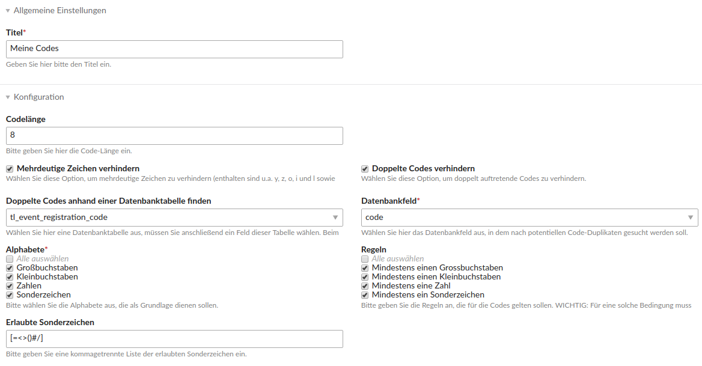
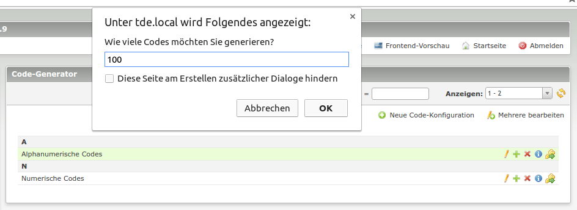

# Code Generator

This module offers comfortable code generation based on separated configurations for Contao.

*Code config preview*

*List view*

## Features

- offers a code configuration entity
- criteria:
    - prevent ambiguous characters
    - prevent double codes
    - limit to certain alphabets (numbers, capitals, ...)
    - add rules like "at least one number"
- one-click-creation of an arbitrary number of codes

### Module

Name | Description
---- | ------------
ModuleCodeGenerator | This backend module creates the codes.