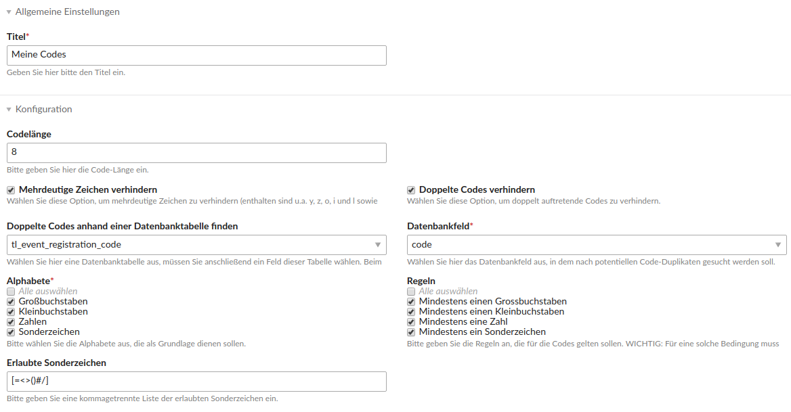
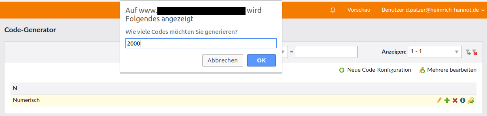

# Code Generator

This module offers comfortable code generation based on separated configurations for Contao.



*Code config preview*



*List view*

## Features

- offers a code configuration entity
- offers a service to create codes
- criteria:
    - prevent ambiguous characters
    - prevent double codes
    - limit to certain alphabets (numbers, capitals, ...)
    - add rules like "at least one number"
- one-click-creation of an arbitrary number of codes

## Developers

```php
use HeimrichHannot\CodeGeneratorBundle\Code\Criteria;
use HeimrichHannot\CodeGeneratorBundle\Code\Generator;

class Example
{
    public function __construct(
        private readonly Generator $generator
    ) {}
    
    public function generatePasswort(): string
    {
        $criteria = new Criteria();
        $criteria->allowSymbols = true;
        $criteria->length = 14;
        $criteria->requireNumbers = true;
        $criteria->requireSymbols = true;
        
        return $this->generator->generate($criteria);
    }
}
```